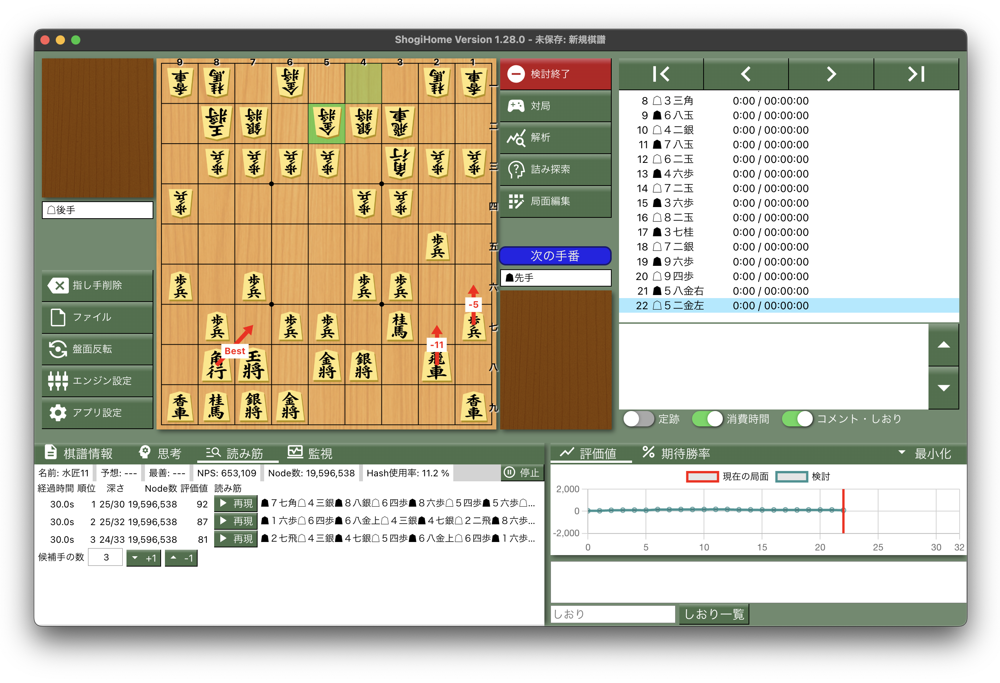
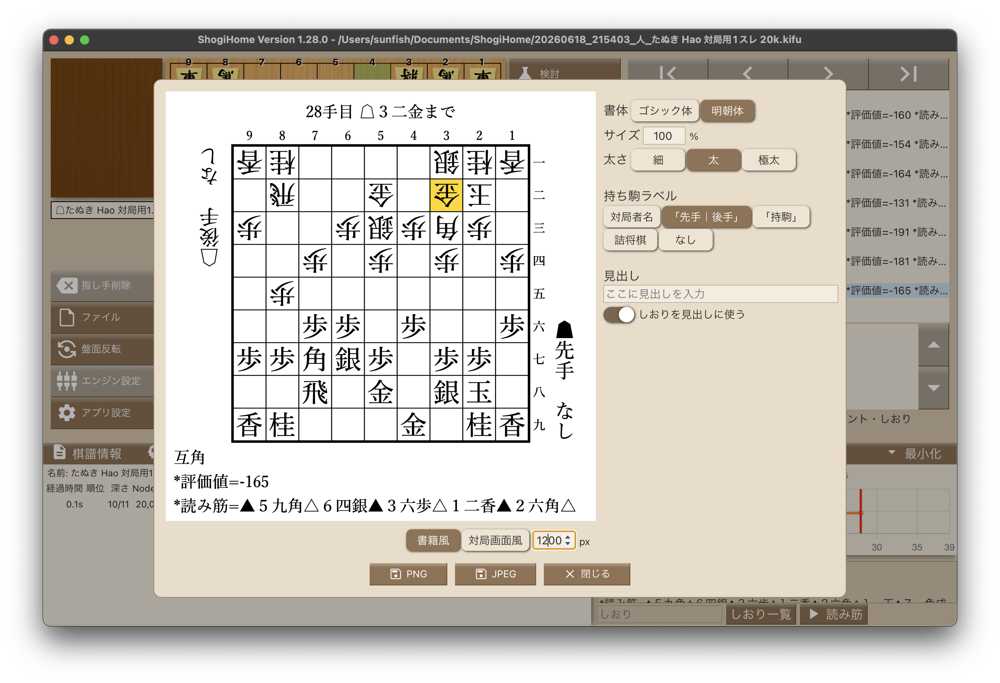
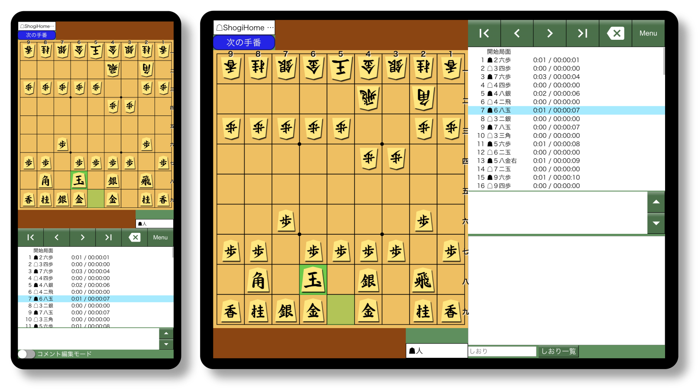

# ShogiHome

[](https://github.com/sunfish-shogi/shogihome/actions/workflows/test.yml)
[](https://github.com/sunfish-shogi/shogihome/actions/workflows/test-cli.yml)
[](https://github.com/sunfish-shogi/shogihome/actions/workflows/audit.yml)
[](https://codecov.io/gh/sunfish-shogi/shogihome)

[日本語](./README.md)

This is a Shogi GUI app.
You can play Shogi with AI, analyze games, and manage records.

You can use this app with any Shogi engines (AI) based on the [USI Protocol](http://shogidokoro2.stars.ne.jp/usi.html), just like [将棋所](http://shogidokoro2.stars.ne.jp/).

## Concept

There are excellent shogi software such as 将棋所 and [ShogiGUI](http://shogigui.siganus.com/).
However, most of them are developed privately and their source codes are not public.
Authoritative Shogi AI developers have advocated [the importance of source code sharing](https://yaneuraou.yaneu.com/2022/01/15/new-gui-for-shogi-is-needed-to-improve-the-usi-protocol/).
ShogiHome publishes all its source codes. You can use or modify it under only a few restrictions.

ShogiHome is developed using [Electron](https://www.electronjs.org/) which is a web-based GUI framework.
We make use of modern web technologies since we want this project to be widely used in the future.
You can even run this on your web browser although only a portion of features are supported.
As an Electron-based app, this is bundled with Chromium, so it is easy to guarantee the same operability and quality across different operation systems.

These days, 2-in-1 laptops are becoming popular.
It is now possible to play Shogi on PCs with a touch screen.
However, legacy desktop Shogi apps have very small UI components. These are not compatible with a touch display.
We designed this app to have operability for touch devices.

## Website

https://sunfish-shogi.github.io/shogihome/

You can try the web app on the above website.

## Wiki

https://github.com/sunfish-shogi/shogihome/wiki

See the above wiki for information about usage and design.

## Screenshots







## Downloads

You can download any version from [Releases](https://github.com/sunfish-shogi/shogihome/releases).

## For Engine Developers

Communication logs of the USI and CSA protocols are disabled by default.
See [this page](https://github.com/sunfish-shogi/shogihome/wiki/%E9%96%8B%E7%99%BA%E8%80%85%E5%90%91%E3%81%91%E6%A9%9F%E8%83%BD%E3%81%AE%E4%BD%BF%E3%81%84%E6%96%B9#%E3%83%AD%E3%82%B0) to enable them.

We have received several inquiries about not being able to register script files as engines. See [this page](https://github.com/sunfish-shogi/shogihome/wiki/%E3%82%B7%E3%82%A7%E3%83%AB%E3%82%B9%E3%82%AF%E3%83%AA%E3%83%97%E3%83%88%E3%82%84%E3%82%A4%E3%83%B3%E3%82%BF%E3%83%97%E3%83%AA%E3%82%BF%E5%9E%8B%E8%A8%80%E8%AA%9E%E3%81%A7%E3%82%A8%E3%83%B3%E3%82%B8%E3%83%B3%E3%82%92%E5%AE%9F%E8%A1%8C%E3%81%97%E3%81%9F%E3%81%84%E6%96%B9%E3%81%B8) if you want to run an engine with a shell script or an interpreted language.

## Bug Reports / Contributing

Make sure to read [CONTRIBUTING.md](CONTRIBUTING.md) before you get involved.

If you have a GitHub account, you can create issues or pull requests.
For major changes, please open an issue to discuss them before starting development.
Make sure to use the provided templates when creating new issues or pull requests.

We strictly refuse issues and pull requests written by AI, as well as automated communication.
Using AI partially or for translation is fine, but a human must be responsible for the conversation.

If not, please send messages through the [Web Form](https://form.run/@sunfish-shogi-1650819491).

You can see the development progress at [Project Board](https://github.com/users/sunfish-shogi/projects/1/views/1).

## Security

If you build ShogiHome yourself, please read [Security for ShogiHome Development](https://note.com/ryosuke_kubo/n/n790345a2b9aa).

## Development

### Requirements

- Node.js

### Setup

```
git clone https://github.com/sunfish-shogi/shogihome.git
cd shogihome
npm ci
```

### Launch

```
# Electron App
npm run electron:serve

# Web App
npm run serve
# Standard: http://localhost:5173
# Mobile  : http://localhost:5173/?mobile
```

### Release Build

```
# Electron App (Installer)
npm run electron:build

# Electron App (Windows Portable App)
npm run electron:portable

# Web App
npm run build
```

### Unit Tests

```
# test only
npm test

# coverage report
npm run coverage

# launch Vitest UI
npm run test:ui
```

### Lint

```
npm run lint
```

## CLI Tools

- [usi-csa-bridge](https://github.com/sunfish-shogi/shogihome/tree/main/src/command/usi-csa-bridge#readme) - Let a USI engine play games via the CSA protocol.

## Licences

### ShogiHome

[MIT License](LICENSE)

### Icon Images

This app uses [Material Icons](https://google.github.io/material-design-icons/) saved in [/public/icon](https://github.com/sunfish-shogi/shogihome/tree/main/public/icon).
These assets are provided under [Apache License 2.0](https://www.apache.org/licenses/LICENSE-2.0.txt).

### Dependencies

See [THIRD PARTY LICENSES](https://sunfish-shogi.github.io/shogihome/third-party-licenses.html) for libraries used from renderer process.

electron-builder bundles license files of Electron and Chromium into artifacts.
